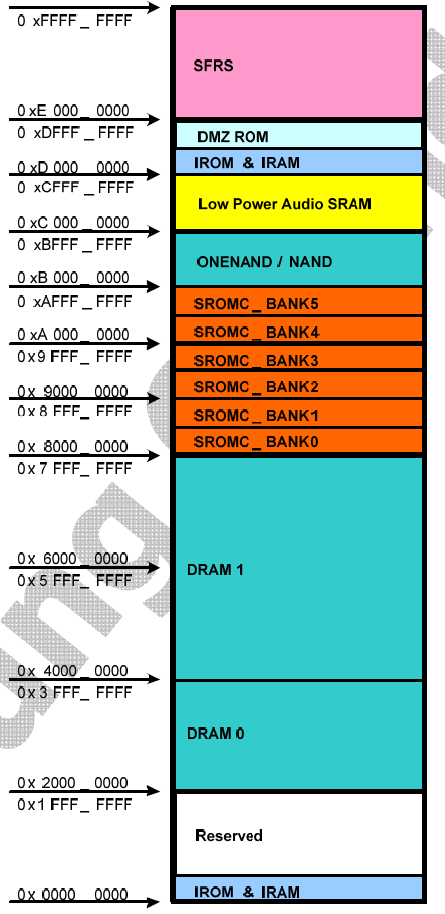

# Memory Distribution

发布版本：1.0

作者邮箱：703632667@qq.com

日期：2018-05-26

------

**前言**

tiny210内存规划。

**修订记录**

| 日期       | 版本 | 作者      | 修改说明 |
| ---------- | ---- | --------- | -------- |
| 2018-05-26 | V1.0 | Jason Zhu |          |

------

[TOC]

## 1. tiny210芯片内存分布
| 地址       | bank | 说明 |
| ---------- | ---- |-------|
| 0xe0000000-0xffffffff | SFRS | |
| 0xd0000000-0xdfffffff | DMZ ROM & IROM & IRAM | |
| 0xc0000000-0xcfffffff | Low Power Audio SRAM | |
| 0xb0000000-0xbfffffff | ONENAND/NAND | |
| 0xa0000000-0xafffffff | SROMC_BANK5-SROMC_BANK4 | |
| 0x90000000-0x9fffffff | SROMC_BANK3-SROMC_BANK2 | |
| 0x80000000-0x8fffffff | SROMC_BANK1-SROMC_BANK0 | |
| 0x40000000-0x7fffffff | DRAM1 | |
| 0x20000000-0x3fffffff | DRAM0 | |
| 0x00000000-0x1fffffff | reserved & IROM & IRAM | |

##2. 内存规划

tiny210（512MB版本）的SDRAM挂载在DRAM0，这里为了运行整个系统，对该512MB区域做完整规划
| 地址       | size | 功能 | 说明      |
| ---------- |-----| ---- | --------- |
| ox20000000-0x21ffffff |32MB| kernel | kernel固件加载存放于此 |
| ox22000000-0x23ffffff | 32MB |dtb & other | dtb等kernel需要的数据 |
| ox24000000-0x243fffff | 4MB |uboot | uboot固件加载于此 |
| 0x40000000 | 1 |SP栈顶 |  |
